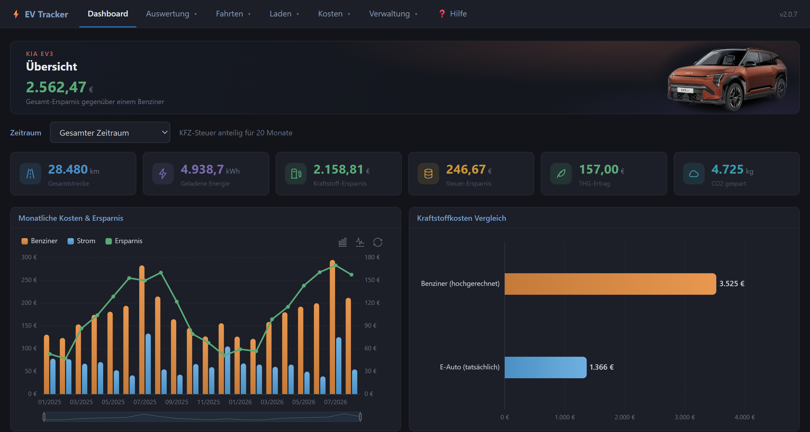
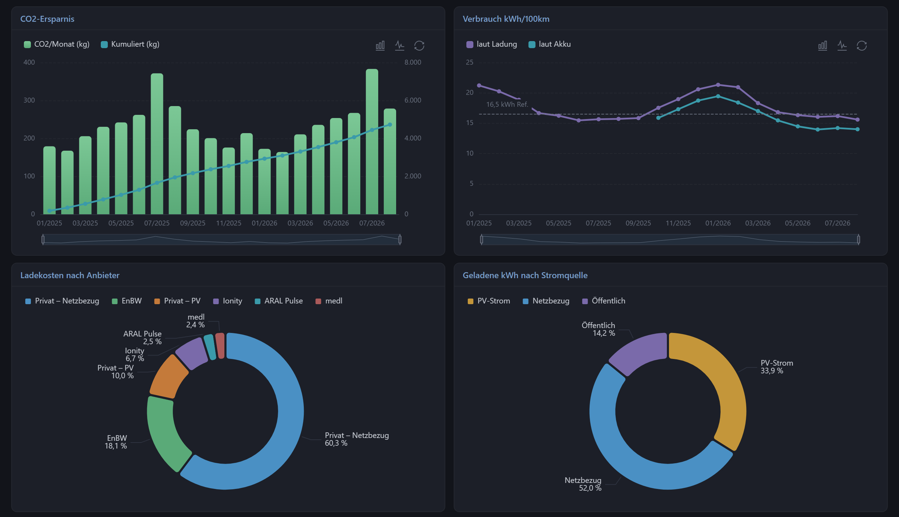
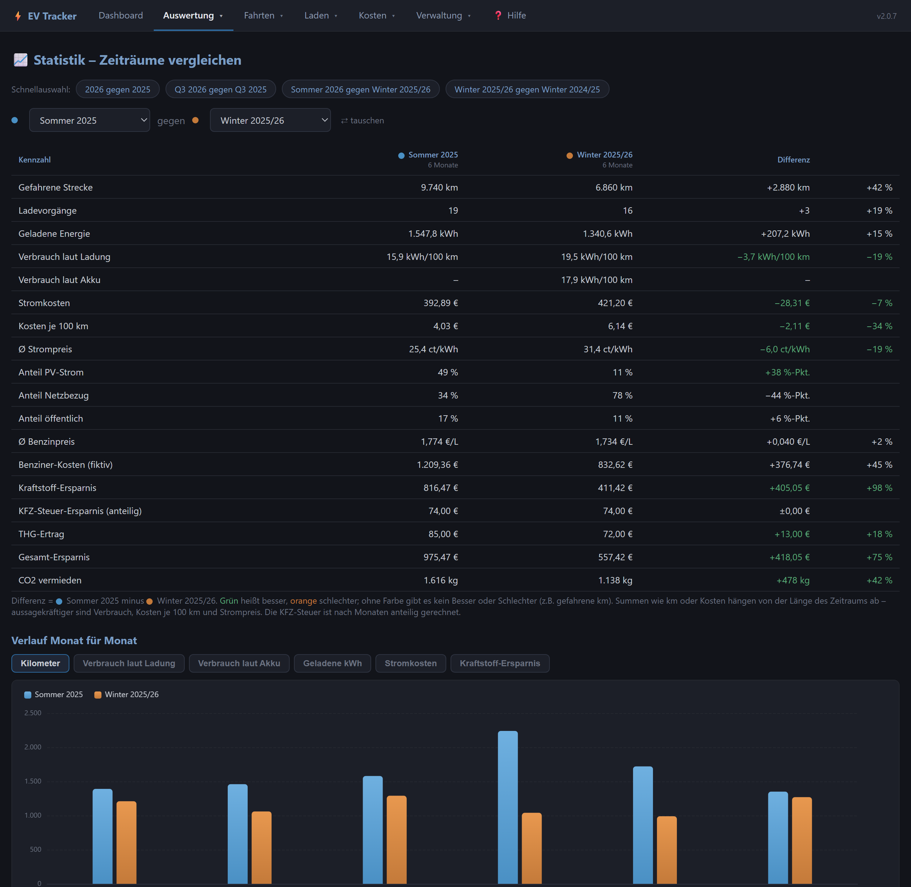
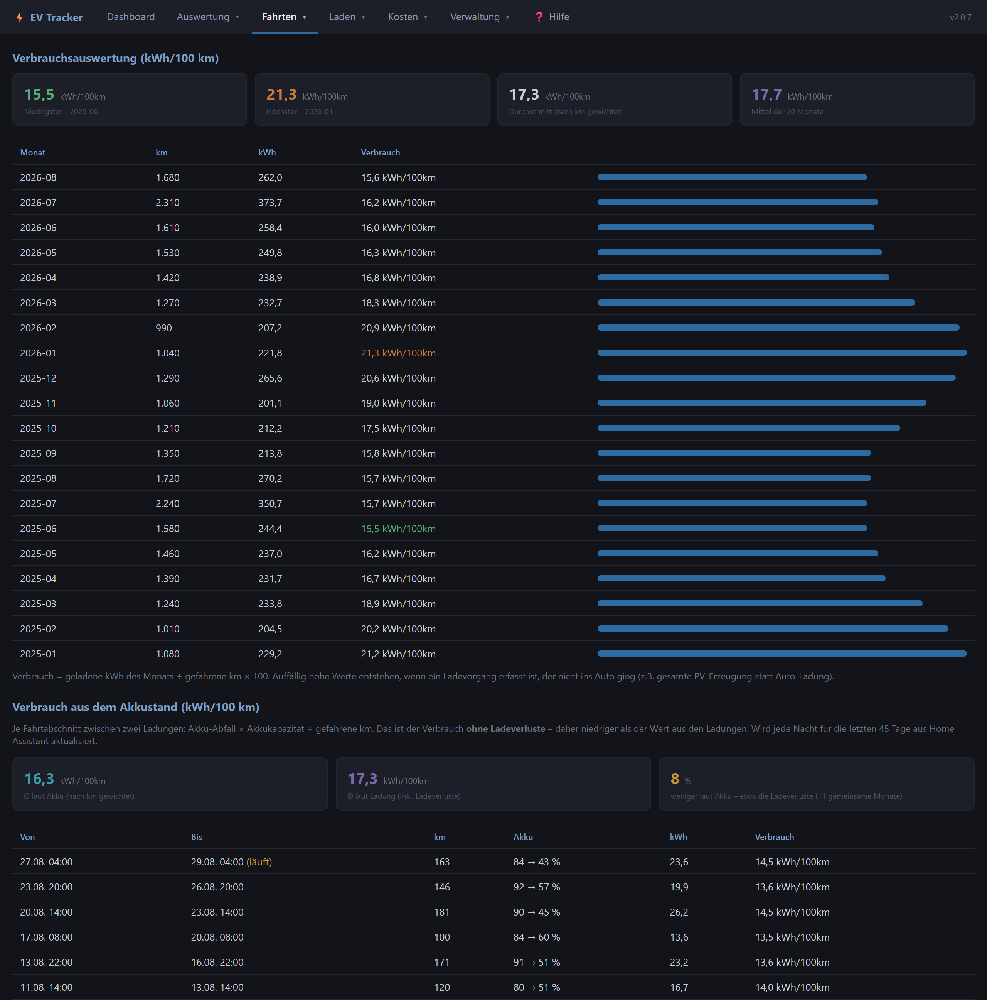
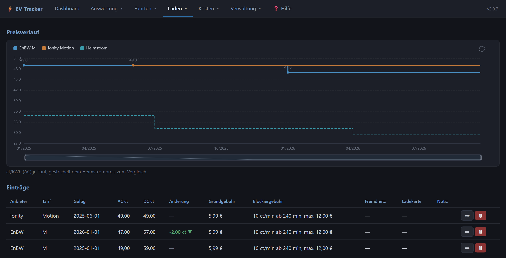
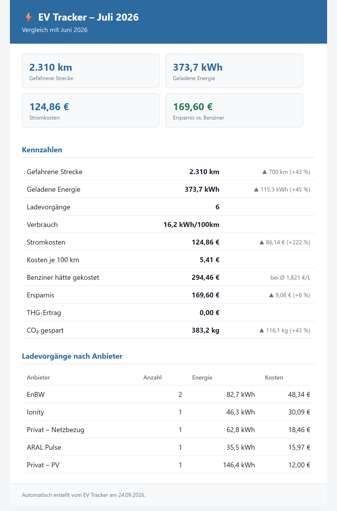

# ⚡ EV Tracker

> 🚧 **Noch in aktiver Entwicklung.** Dieses Add-on wird mit Unterstützung von KI (Claude)
> erstellt und getestet. Funktionen, Konfiguration und Datenstruktur können sich noch
> ändern; vor größeren Updates lohnt sich eine Sicherung über Home Assistants eigene
> Backups. Rückmeldungen und Fehlerberichte sind willkommen.

Web-App zur Erfassung und Auswertung der Kosteneinsparungen eines Elektroautos
gegenüber einem Benziner. Fahrzeugname und -bild sind in den Einstellungen frei wählbar –
nicht auf ein bestimmtes Modell festgelegt.

## Einblicke

*Alle Bilder mit Beispieldaten: 20 Monate, ein Elektroauto mit Wallbox und PV-Anlage.*

<table>
<tr>
<td width="50%">
 <b>Alles auf einen Blick</b> – CO₂-Ersparnis, Verbrauch im Jahresverlauf, wohin das Geld fürs Laden geht und wie viel davon Solarstrom war.</td>
<td width="50%">
 <b>Sommer gegen Winter</b> – zwei Zeiträume nebeneinander: Verbrauch, Kosten je 100 km, PV-Anteil, Ersparnis.</td>
</tr>
<tr>
<td>
 <b>Echter Verbrauch</b> – je Monat aus den Ladungen und je Fahrt aus dem Akkustand. Die Differenz zeigt die Ladeverluste.</td>
<td>
 <b>Ladetarife im Griff</b> – Abos mit Preisverlauf, Grundgebühr und Blockiergebühr, im Vergleich zum Heimstrom.</td>
</tr>
<tr>
<td>
 <b>Monatsbericht per Mail</b> – kommt automatisch, sobald der Monat vollständig ist.</td>
<td valign="top"> <b>Und außerdem:</b> Import aus Home Assistant oder einer Datenbank (InfluxDB 1.x/2.x, PostgreSQL/TimescaleDB, Prometheus/VictoriaMetrics), jede Nacht automatisch · Rechnungs-PDFs einlesen · Ladeerkennung am Akkustand (meldet Ladungen unterwegs ohne Beleg) · THG-Quote und KFZ-Steuer · Instandhaltung und Versicherung · Backup und Wiederherstellen</td>
</tr>
</table>

## Voraussetzungen

Der EV Tracker **misst selbst nichts** – er liest jeden Monat vorhandene Sensoren aus Home
Assistant (oder einer Datenbank wie InfluxDB) aus. Damit die Auswertung funktioniert, müssen diese Sensoren
vorher in Home Assistant eingerichtet sein:

| Was | Wozu | Hinweis |
|-----|------|---------|
| ⛽ **Tankerkönig-Integration** | Benzinpreis für den Vergleich mit einem Verbrenner | Kostenlosen API-Key bei [Tankerkönig](https://creativecommons.tankerkoenig.de/) holen, Integration in HA einrichten und die Tankstelle(n) wählen, an der man sonst tanken würde. Bis zu zwei Preis-Sensoren (€/L) können eingetragen werden, es wird der Monatsdurchschnitt gebildet. |
| 🔌 **Geladene kWh aus dem Netz** | Stromkosten für das Laden zu Hause (Netzbezug) | Muss **außerhalb** des EV Trackers gezählt werden – z. B. durch den Energiezähler der Wallbox oder einen Zwischenzähler. Benötigt wird ein fortlaufender kWh-Zähler. |
| ☀️ **Geladene kWh aus der PV** | Anteil des Solarstroms am Laden (mit eigenem PV-Preis bewertet) | Ebenfalls **außerhalb** des Tools zu ermitteln, z. B. über die Wallbox-/PV-Steuerung (evcc, go-e, OpenWB …) oder einen Template-/Utility-Meter-Sensor. Fortlaufender oder täglich zurückgesetzter kWh-Zähler. |
| 🚗 **Kilometerstand** | Gefahrene km pro Monat | Z. B. über die Fahrzeug-Integration des Herstellers |
| 🔋 *Batteriestand (optional)* | Ladeerkennung und Verbrauch aus dem Akkustand | Ebenfalls über die Fahrzeug-Integration |

Die Entity-IDs werden anschließend in den **Einstellungen** des EV Trackers eingetragen.
Die Aufteilung Netz/PV kann der EV Tracker nicht selbst berechnen – ohne diese beiden
Zähler fehlen die Kosten fürs Laden zu Hause. Ladevorgänge unterwegs (öffentliche
Ladesäulen) werden dagegen direkt in der App erfasst.

## Installation als Home-Assistant-Add-on

1. **Einstellungen → Add-ons → Add-on-Store** → oben rechts ⋮ → **Repositories**
2. URL einfügen: `https://github.com/HasenbeinMH/ev-tracker-ha`
3. **Hinzufügen**, Store neu laden
4. Unter „EV Tracker" erscheint **EV Tracker** → installieren, starten
5. Läuft komplett per Ingress (eigener Menüpunkt in der Seitenleiste) – kein offener Port,
   kein manuelles Access-Token nötig

## Funktionen

| Seite | Beschreibung |
|-------|-------------|
| 📊 Dashboard | Gesamtübersicht, Kennzahlen, alle Charts |
| 🚗 Fahrten | km erfassen, Benzin-Äquivalent, Verbrauch kWh/100 km |
| 🔌 Laden | Ladevorgänge mit kWh, Preis, Anbieter, AC/DC, Blockiergebühr |
| 🔋 Ladetarife | Eigene Lade-Abos mit Preisverlauf |
| ⛽ Benzinpreise | Monatsdurchschnitte + Preisverlauf |
| ⚡ Stromtarif | Tarifliste mit Preisverlauf |
| 💶 Steuer & THG | KFZ-Steuer-Ersparnis + THG-Quote-Erträge |
| 🔧 Instandhaltung | Werkstatt, Reifen, Verschleiß, HU – umgerechnet auf €/100 km |
| 🛡️ Versicherung | Gesellschaft, Deckung, SF-Klassen, Zusatzbausteine |
| 📥 HA Import | Nächtlicher Abruf aus Home Assistant, mit Protokoll |
| 🧾 Rechnungen | PDF-Rechnungen einlesen |
| 📄 Berichte | Monatsbericht als PDF, optional per Mail |
| 💾 Backup | Datenbank sichern und zurückspielen |
| ❓ Hilfe | Handbuch, Herleitung jeder Kennzahl, Änderungslog |

## Daten

Alle Daten liegen in einer eigenen SQLite-Datenbank (`ev_tracker.db`), im Add-on-Betrieb
unter `/data` – wird automatisch von Home Assistants eigenen Sicherungen mit erfasst.

## Benzin-Äquivalent

Berechnung: `km / 100 × 7,0 L × Benzinpreis`
Standard-Referenzverbrauch: **15 kWh/100 km** (in den Einstellungen pro Fahrzeug anpassbar)

---

## Für Entwickler: zwei Betriebsarten, eine Codebasis

Dieses Repo unterstützt zwei Deployments **derselben** App – das Home-Assistant-Add-on
(oben) und einen eigenständigen Docker-Betrieb (Portainer o.ä., siehe
[webapp/README.md](webapp/README.md)). Die eigentliche Anwendung (`webapp/app.py`,
`database.py`, `ha_client.py`, alle Templates usw.) ist bewusst **gemeinsamer Code** –
Änderungen dort wirken sich immer auf beide Betriebsarten aus, das ist gewollt (gleiche
Funktionen, nur anders verpackt). Nur diese Dateien sind jeweils exklusiv für eine
Betriebsart und beeinflussen die andere nicht:

| Datei | Gehört zu |
|-------|-----------|
| `Dockerfile`, `config.yaml`, `repository.yaml`, `icon.png`, `logo.png` | **Home-Assistant-Add-on** |
| `docker-compose.yml`, `webapp/Dockerfile`, `backup.sh`, `backup_db.py` | **Standalone-Docker** (Portainer o.ä.) |

Wo sich das Verhalten der App selbst je nach Betriebsart unterscheidet (Backup-Seite,
Home-Assistant-Verbindung), steht im Code immer die Variable `IST_ADDON`
(`ha_client.py`, dort auch `ha_verbindung()`) – erkennt automatisch, ob `SUPERVISOR_TOKEN` gesetzt ist. Danach
suchen, wenn unklar ist, wo genau sich beide Wege unterscheiden.

### Aufbau

| Ordner / Datei | Inhalt |
|----------------|--------|
| `webapp/` | FastAPI-Anwendung, Templates, statische Dateien, Dockerfile |
| `charts.py` | Chart-Definitionen (Apache ECharts), werden im Browser gezeichnet |
| `berechnung.py` | Alle Kennzahlen und Ersparnis-Berechnungen |
| `database.py` | SQLite-Zugriff und Schema |
| `ha_client.py` | Home Assistant (REST, WebSocket, Supervisor) |
| `datenquellen.py` | Datenbanken: InfluxDB 1.x/2.x, PostgreSQL/TimescaleDB (LTSS), Prometheus/VictoriaMetrics |
| `berichte.py`, `mailer.py` | Monatsbericht als PDF, Mailversand |
| `pdf_parser.py`, `ladeerkennung.py` | Rechnungs-PDFs, Erkennung von Ladevorgängen |
| `backup_db.py`, `backup.sh` | Sicherung der Datenbank (nur Standalone-Docker) |
| `settings_tool.py` | Einstellungen als JSON exportieren/importieren |
| `testdaten.py`, `testdaten.bat` | Testdaten anlegen |
| `tests/funktionstest.py` | Funktions- und Plausibilitätstest mit eigener Test-DB: `python tests/funktionstest.py` (braucht zusätzlich `httpx`) |
| `tests/datenquellen_test.py` | Test der Datenbank-Anbindungen gegen nachgebaute Server: `python tests/datenquellen_test.py` |
| `tests/datenquellen_docker_test.py` | Dieselben Anbindungen gegen echte Server in Docker (InfluxDB 1.8/2.7, TimescaleDB, VictoriaMetrics, Prometheus): `python tests/datenquellen_docker_test.py` |
| `version.py` | Versionsnummer und Änderungslog |
